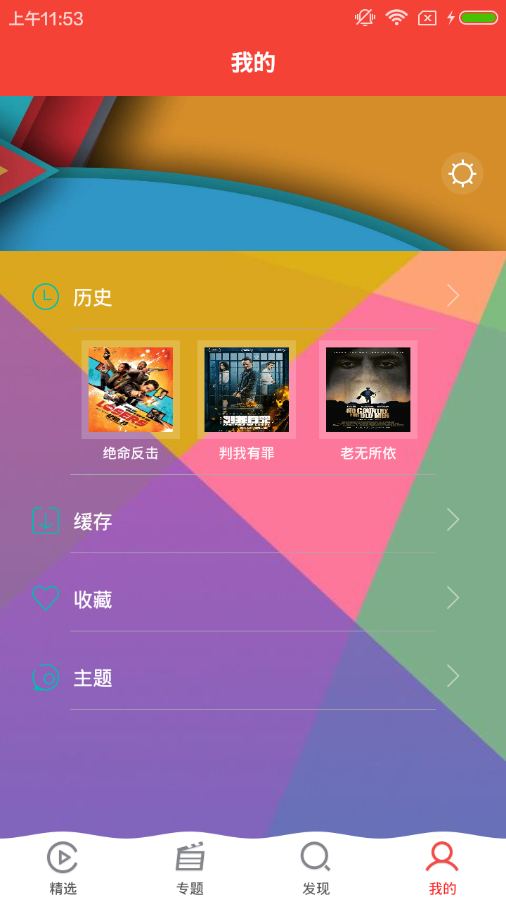
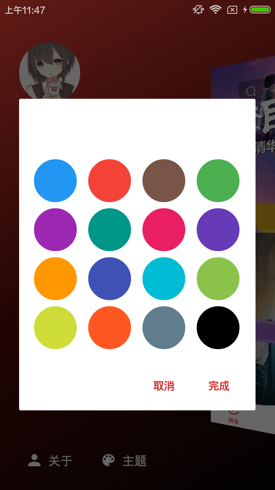

# 一款纯粹的在线视频App，基于Material Design + MVP + RxJava + Retrofit + Realm + Glide

## 效果

[demo下载地址](https://www.pgyer.com/bAQp)

 

 

 

<!-- -->

 

 

#技术点
* 使用RxJava配合Retrofit2做网络请求
* 使用RxUtil对线程操作和网络请求结果处理做了封装
* 使用RxPresenter对订阅的生命周期做管理
* 使用AndroidEventBus来方便组件间的通信
* 使用Material Design控件和动画
* 使用MVP架构整个项目，对应于model、ui、presenter三个包
* 使用Realm做阅读记录和收藏记录的增、删、查、改
* 使用Glide做图片的处理和加载
* 使用RxJava和Retrofit进行图片下载功能
* 使用RecyclerView实现下拉刷新、上拉加载、侧滑删除、长按拖曳
* 支持主题设置
* 包含搜索、收藏、历史等功能

###RES:
[iconfont](http://www.iconfont.cn/) 提供了icon素材

[material UP](http://www.material.uplabs.com/) 提供了Material Design风格的素材

[Launcher icons](http://romannurik.github.io/AndroidAssetStudio/icons-launcher.html)

###LIB:
####UI
* [MaterialSearchView](https://github.com/MiguelCatalan/MaterialSearchView)
* [multiline-collapsingtoolbar](https://github.com/opacapp/multiline-collapsingtoolbar)

####RX

* [RxJava](https://github.com/ReactiveX/RxJava)
* [RxAndroid](https://github.com/ReactiveX/RxAndroid)
* [RxBinding](https://github.com/JakeWharton/RxBinding)

####NETWORK

* [Gson](https://github.com/google/gson)
* [Retrofit](https://github.com/square/retrofit)
* [OkHttp](https://github.com/square/okhttp)
* [Glide](https://github.com/bumptech/glide)

####DI
* [ButterKnife](https://github.com/JakeWharton/butterknife)

####FRAGMENT

* [Fragmentation](https://github.com/YoKeyword/Fragmentation)

####LOG

* [Logger](https://github.com/orhanobut/logger)

####DB

* [Realm](https://github.com/realm/realm-java)

####CANARY

* [BlockCanary](https://github.com/markzhai/AndroidPerformanceMonitor)
* [LeakCanary](https://github.com/square/leakcanary)

####THANKS

* [JieCaoVideoPlayer](https://github.com/lipangit/JieCaoVideoPlayer)
* [EasyRecyclerView](https://github.com/Jude95/EasyRecyclerView)
* [GanK](https://github.com/dongjunkun/GanK)
* 美女福利图片接口来[自干货集中营](http://gank.io/api)

* [仿探探首页滑动效果](https://github.com/yuqirong/CardSwipeLayout)

* [五行代码实现 炫动滑动 卡片层叠布局，仿探探、人人影视订阅界面 简单&优雅：LayoutManager+ItemTouchHelper](http://blog.csdn.net/zxt0601/article/details/53730908)

* [仿咸鱼的首页](http://www.jianshu.com/p/41e52b544e86)

* [DataBinding的使用心得](http://www.jianshu.com/p/d4e384c98987)